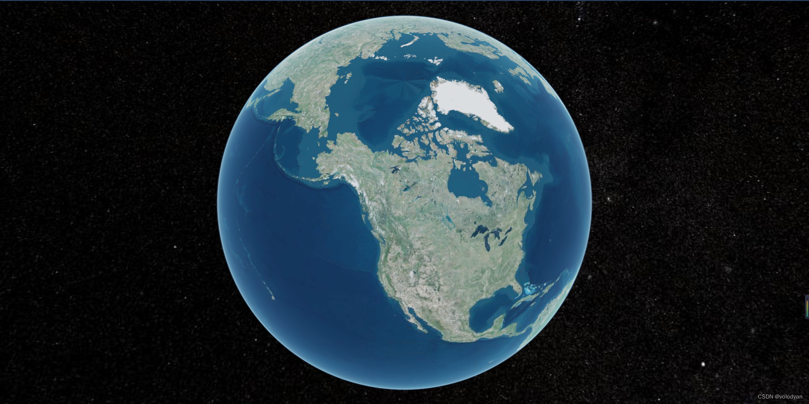

# vue_cesium_demo

## Project setup
```
npm install
```

### Compiles and hot-reloads for development
```
npm run serve
```

### Compiles and minifies for production
```
npm run build
```
## 1.环境信息

```
node v16.15.0
npm 8.5.5
@vue/cli 5.0.8
cesium 1.103.0
```

```
注意：vue-cli5 以上和 vue-cli5 以下，配置方式不同。
vue-cli5 以下参考另一篇博客 vue 集成 cesium
```

 ## 2. 安装并配置 cesium
    #### 2.1. 项目初始化 
         ```
         vue create vue_cesium_demo
         ```
    #### 2.2. 安装 cesium
       ```
        npm install cesium
       ```
   #### 2.3. 配置 cesium 

      ```
       npm install -D copy-webpack-plugin node-polyfill-webpack-plugin @open-wc/webpack-import-meta-loader
      ```

###### vue.config.js

``` 
const { defineConfig } = require('@vue/cli-service')
 
const path = require('path')
const webpack = require('webpack')
const CopyWebpackPlugin = require('copy-webpack-plugin')
const NodePolyfillPlugin = require('node-polyfill-webpack-plugin')
 
function resolve(dir) {
  return path.join(__dirname, dir)
}
 
module.exports = defineConfig({
  transpileDependencies: true,
  configureWebpack: {
    name: 'vue-cesium',
    resolve: {
      alias: {
        '@': resolve('src')
      }
    },
    plugins: [
      new NodePolyfillPlugin(),
      new CopyWebpackPlugin({
        patterns: [
          {
            from: 'node_modules/cesium/Build/Cesium/Workers',
            to: 'cesium/Workers'
          },
          {
            from: 'node_modules/cesium/Build/Cesium/ThirdParty',
            to: 'cesium/ThirdParty'
          },
          {
            from: 'node_modules/cesium/Build/Cesium/Assets',
            to: 'cesium/Assets'
          },
          {
            from: 'node_modules/cesium/Build/Cesium/Widgets',
            to: 'cesium/Widgets'
          }
        ]
      }),
      new webpack.DefinePlugin({
        // Define relative base path in cesium for loading assets
        CESIUM_BASE_URL: JSON.stringify('./cesium')
      })
    ],
    module: {
      rules: [
        {
          test: /.js$/,
          include: /(cesium)/,
          use: {
            loader: '@open-wc/webpack-import-meta-loader'
          }
        }
      ]
    }
  }
})
```

## 3. cesium 简单使用示例

```
<template>
  <div :id="id" ref="cesiumContainer" :style="{ height, width }" />
</template>
 
<script>
import 'cesium/Build/Cesium/Widgets/widgets.css'
import { Viewer } from 'cesium'
 
export default {
  name: 'CesiumMap',
  props: {
    id: {
      type: String,
      default: (() => Math.random().toString(36).substr(2))()
    },
    width: {
      type: String,
      default: '100%'
    },
    height: {
      type: String,
      default: '100%'
    }
  },
  data() {
    return {
      viewer: null
    }
  },
  mounted() {
    this.initCesium()
  },
  beforeDestroy() {
    if (this.viewer) {
      this.viewer.destroy()
      this.viewer = null
    }
  },
  methods: {
    initCesium() {
      const el = this.$refs.cesiumContainer
 
      this.viewer = new Viewer(el, {
        selectionIndicator: false,
        infoBox: false,
        contextOptions: {
          // 硬件反走样，默认值为 1
          msaaLevel: 8,
          requestWebgl2: true
        },
        animation: false,
        timeline: false, // 底部时间线
        fullscreenButton: false, // 全屏
        vrButton: false, // VR
        sceneModePicker: false, // 选择视角的模式（球体、平铺、斜视平铺）
        baseLayerPicker: false, // 图层选择器（地形影像服务）
        navigationHelpButton: false, // 导航帮助(手势，鼠标)
        geocoder: false, // 位置查找工具
        homeButton: false // 视角返回初始位置
      })
      // 去除logo
      this.viewer.cesiumWidget.creditContainer.style.display = "none";
 
    }
  }
}
</script>
```

```
隐藏的logo方法:

在viewer的options属性里设置是不起作用的，需要单独设置，代码如下：

// 去除logo
viewer.cesiumWidget.creditContainer.style.display = "none";
```

## 4.显示效果




